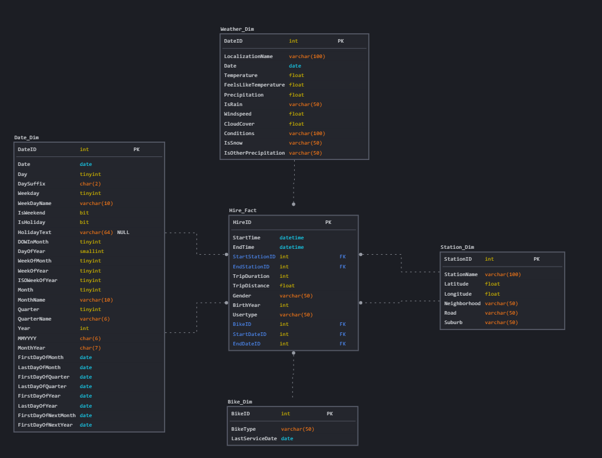

# Wstępna dokumentacja projektowa (w ramach kamienia milowego 1)

## Opis biznesowy
### Why

*(Jakie korzyści będzie miał użytkownik z naszego projektu? / Jaka jest przyczyna powstania projektu? / Jaki dostrzegamy problem i chcemy go rozwiązać?)*

Hurtownia danych i system Bussiness Inteligence służący do prezentacji raportów to jedno z najlepszych narzędzi wspomagających podejmowanie strategicznych decyzji biznesowych.

Dzięki zebraniu i uspójnieniu danych z różnych źródeł w bardzo prosty sposób można stworzyć raport i wizualzację która pomoże osobom decyzyjnym w dostrzeżeniu problemów w obecnym działaniu organizacji, czy też w podjęciu dezycji w jaki sposób rozwijać, czy też modyfikować działanie firmy.

Ten sposób przechowywania danych jest również przystosowany do wprowadzania zmian w przyszłości, ponieważ system jest podzielony na warstwy. Zmiana w formacie źródłowym jednego zbioru wejściowego nie powoduje konieczności zmian całej hurtowni danych, lecz jedynie poprawkę w warstwie ETL. Podobnie w prosty sposób można zmienić dostawcę oprogramowania używanego w warstwie raportowania jeśli taka potrzeba zajdzie. 

Projekt ten powstaje, aby w intuicyjny sposób umożliwić pracownikom organizacji analizę danych (które i tak są już zbierane, w celu zapewnienia poprawności działania systemu) i wyciąganie z nich wniosków mających wpływ na zyski, koszty utrzymania biznesu lub ważne decyzje biznesowe.

### How
*(Co będzie prezentowane końcowemu użytkownikowi? / Co chcemy ułatwić?)*

Końcowy użytkownik będzie miał dostęp do różnych raportów, dzięki czemu zrozumie w jaki sposób użytkownicy korzystają z systemu. Przykładowymi wizualizacjami, które mogą powstać z systemu są:

- liczba kilometrów przejechanych przez dany rower -> które pojazdy należy serwisować w pierwszej kolejności
- z których stacji wypożycza się najwięcej rowerów? czy zmienia się to z godziną wypożyczenia? może z dniem tygodnia? pogodą? -> gdzie transportować rowery i w jakich ilościach, tak aby ich nie brakowało
- jaki jest średni czas wypożyczenia roweru? czy zależy od lokalizacji? typu użytkownika -> pozwala na szacowanie liczby rowerów, które są używane w danej chwili, potrzebne do obiczenia wolumenu zakupu nowych pojazdów
- w jakich godzinach użytkownicy korzystają z rowerów -> kiedy można zabrać rowery do serwisu
- jakie odległości pokonują użytkownicy w zależności od typu roweru? -> może należy powiększyć flotę rowerów elektrycznych
- ...

### What

*Jakie dane analizujemy (bardzo krótki opis źródła oraz co można z wyciągnąć)*

W ramach projektu analizujemy wystawione publicznie dane raportowe dotyczące wypożyczeń rowerów. Dane te są udostępniane po każdym miesiącu kalenarzowym. Jeden wiersz odpowiada jednokrotemu wypożyczeniu roweru przez jednego użytkownika. Znajdują się w nim takie dane jak:
- stacja początkowa i końcowa wypożyczenia,
- godzina rozpoczęcia i zakończenia wypożyczenia,  
- informacje o użytkowniku (płeć, rok urodzenia, typ: subskrybent/wypożyczenie okazjonalne)
- identyfikator roweru

W przypadku, gdyby rozwiązanie powstawało w porozumieniu z klientem, dane mogłyby być odświeżane częściej niż co miesiąc z transakcyjnej bazy danych (na przykład co tydzień - miesiąc w sezonie rowerowym to dość długo -> mało czasu na decyzje). Wtedy również rozwiązalibyśmy problem braku przypisania wypożyczenia do konkretnego użytkownika - w danych publicznych ta informacja musiała zostać usunięta, w celu zachowania anonimowości klientów, ale w hurtowni danych pozwoliłaby na jeszcze dogłębniejsze analizy - na przykład, czy któś nie korzysta z systemu w sposób niezgodny z regulminem, albo opracowanie zniżek dla użytkowników korzystających z systemu w sposób regularny.

Drugim źródłem informacji jest api zawierające historyczne dane pogodowe. Dzięki niemu uzyskujemy jeszcze bardziej dogłębne informacje - jak warunki pogodowe wpływają na korzystanie z systemu przez użytkowników. 

## Opis danych

Dane z pierwszego źródła to [pobrane z sieci pliki](https://citibikenyc.com/system-data) płaskie (jeden plik `.csv` odpowiada jednemu miesiącowi wypożyczeń). Każdy z nich zawiera następujące pola:

- `tripduration` - długość wypożyczenia w sekundach
- `starttime` - dokładna data i godzina wypożyczenia roweru
- `stoptime` - dokładna data i godzina zwrócenia roweru
- `start/stop station id` - identyfikator stacji wypożyczenia/zwrotu
- `start/stop station name` - nazwa stacji wypożyczenia/zwrotu
- `start/stop station latitude` - szerokość geograficzna stacji wypożyczenia/zwrotu
- `start/stop station longitude` - długość geograficzna stacji wypożyczenia/zwrotu
- `bikeid` - identyfikator roweru
- `usertype` - typ użytkownika (okazjonalny lub subskrybent)
- `birth year` - rok urodzenia użytkownika
- `gender` - płeć podana przeż użytkownika

Drugie źródło danych, z którego korzystamy przy tworzeniu hurtowni to [api pogodowe](https://www.visualcrossing.com/), dostarczające historyczne dane pogodowe. Api dostarcza bardzo dużo danych pogodowych, jednak nie korzystamy ze wszystkich kolumn. Poniżej przedstawiamy te, z których korzystamy:

- `name` - lokalizacja, której dotyczy wiersz
- `datetime` - data, której dotyczy dany wiersz
- `temp` - średnia temperatura z danego dnia w stopniach celsjusza
- `feelslike` - średnia odczuwalna temperatura z danego dnia
- `precip` - ilość opadu w mm
- `precipcover` - procent doby, w którym występował opad
- `preciptype` - typ opadu (deszcz/śnieg/inne)
- `windspeed` - prędkość wiatru
- `cloudcover` - procent zachmurzenia nieba
- `conditions` - słowny opis warunków atmosferycznych.

## Opis architektury
### Warstwy modelu

(opis!)

### ETL

W warstwie ETL będziemy wykonywać następujące przekształcenia:

* Wczytanie danych dotyczących wypożyczeń z plików płaskich `.csv`
* Zmiana nazw kolumn tak, aby dokładnie opisywały, co zawierają (np. `feelslike` -> `FeelsLikeTemperature`, `lat` -> `Latitude` itd.)
* Ujednolicenie stylu nazewnictwa kolumn (zdecydowaliśmy się na PascalCase)
* Przekształcenia tabeli faktów:
    - na podstawie pól startu i zwrotu roweru stworzenie pól typu `int` -> identyfikatorów daty, aby połączyć wymiar kalendarza (klucze obce)
    - stworzenie nowej miarki: długość wycieczki: obliczane na podstawie współrzędnych stacji początkowej i końcowej
    - przekształcenie kodu płci na tekst (1 -> "Male", 2-> "Female", 0 -"> Unknown")
*   stworzenie tabel wymiarowych na podstawie danych o rowerach
    - do wymiaru roweru stworzone pole typu roweru (elektryczny, tandem, zwykły) - nie ma tego w wersji danych z których korzystamy, więc ustalamy sztucznie na podstawie identyfikatora roweru - kończące się na 9 są elektryczne, a kończące się na 8 to tandemy, reszta zwykłe
    - do wymiaru roweru dodajemy pole z datą ostatniego serwisowania (sztucznie generowana)
    - do wymiaru stacji przenosimy kolumny związane z jej nazwą oraz współrzędnymi geograficznymi
    - zaokrąglenie współrzędnych geograficznych do 5 miejsc po przecinku (w danych nie zawsze spójnie) -> dokładność ok. 1 m
* stworzenie i przekształcenia tabeli wymiarowej z danych pogodowych
    - wysłanie zapytania do api i wczytanie danych z otrzymanego pliku `.json`
    - wybór najważniejszych kolumn (tych opisanych w sekcji [opis danych](#opis-danych)), zignorowanie pozostałych
    - rozdzielenie kolumny `preciptype`, która ma wylistowane rodzaje opadów w ciągu danego dnia na trzy kolumny `IsRain`, `IsSnow`, `IsOtherPrecipitation`, które mówią czy w danym dniu występował opad tego rodzaju
    - połączenie kluczem obcym (datą w formacie `int`) wymiaru pogody z tabelą faktów.

 (napisać o wymiarze użytkownika)

### Ostateczny (na ten moment) model hurtowni

Tabela faktów w naszej hurtowni będzie nazywać się *Hire Fact* Oprócz atrybutu faktów i miary będzie zawierać zdegenerowany wymiar użytkownika oraz klucze obce do tabel wymiarów. *StartStationId* oraz *EndStationId* wsakazują na wymiar stacji *Station_Dim*, który zawiera współrzędne geograficzne stacji. *BikeId* łączy tabele fatków z wymiarem *Bike_Dim* zawierającym typ wypożyczonego roweru.

pomysły/pytania

- do wymiaru stacji dzielnica
- czy jest sens pogodę co godzinę
- grad/inne opady jak do tego podejść
